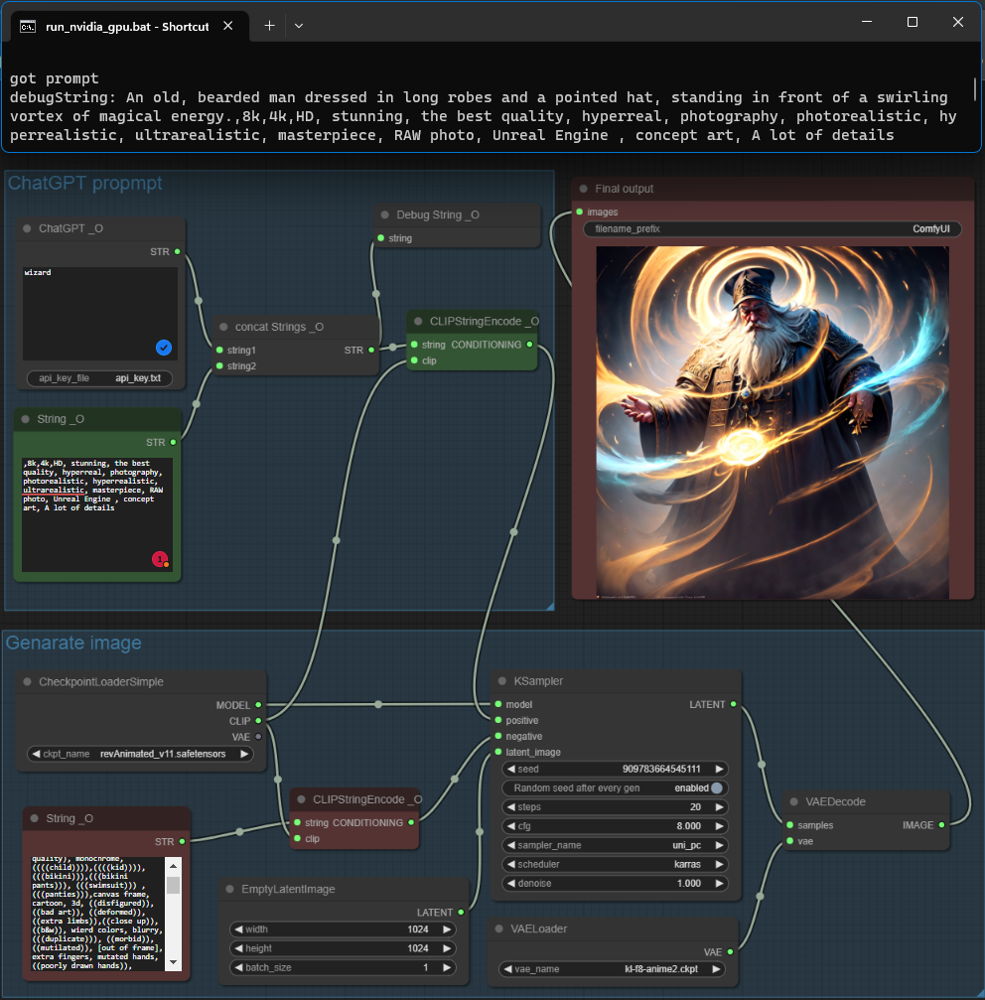
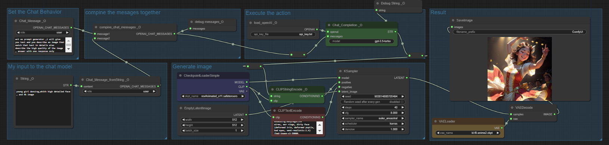

# ComfyUI Quality of Life Suite — Omar92

> **Thank you to all the valuable contributors. Kindly submit any pull requests to the development branch instead of the main branch. Your efforts are greatly appreciated.**

A feature-rich [ComfyUI](https://github.com/comfyanonymous/ComfyUI) extension providing 50+ quality-of-life nodes including OpenAI (ChatGPT & DALL-E 2) integration, text processing, image/latent scaling, math utilities, and more.

---

## Table of Contents

- [Features](#features)
- [Installation](#installation)
- [Configuration](#configuration)
- [Node Reference](#node-reference)
  - [OpenAI Suite](#openai-suite)
  - [String Suite](#string-suite)
  - [Latent Tools](#latent-tools)
  - [Image Tools](#image-tools)
  - [Number / Math Tools](#number--math-tools)
  - [Utility Nodes](#utility-nodes)
  - [Debug Nodes](#debug-nodes)
- [Example Workflows](#example-workflows)
- [Fonts](#fonts)
- [Auto-Update](#auto-update)
- [Contact](#contact)

---

## Features

- 🤖 **OpenAI Integration** — ChatGPT (GPT-3.5 / GPT-4) prompt generation and DALL-E 2 image creation
- 📝 **String Suite** — Concatenate, trim, replace, split, and save text; convert text to an image
- 🎲 **NSP (Noodle Soup Prompts)** — Random prompt term generation from categorised terminology
- 🖼️ **Image Tools** — Scale images using multiplication factors instead of fixed pixel dimensions
- 🔲 **Latent Tools** — Upscale latents by factor and select individual latents from a batch
- 🔢 **Number / Math Tools** — Evaluate equations, convert between types, read image/latent dimensions
- 🛠️ **Utility Nodes** — Thin wrappers for text, integer, float, and seed inputs
- 🐛 **Debug Nodes** — Write intermediate values to the console, optionally passing them through

All nodes appear in the ComfyUI menu under the **`O/`** top-level category.

---

## Installation

### Option A — Manual (zip)

1. Download the repository as a zip file.
2. Extract the folder into `<ComfyUI root>/custom_nodes/`.
3. The resulting path should look like `custom_nodes/ComfyUI-QualityOfLifeSuit_Omar92/`.
4. Restart ComfyUI (a browser reload is **not** sufficient).

### Option B — Git clone

```bash
cd <ComfyUI root>/custom_nodes
git clone https://github.com/omar92/ComfyUI-QualityOfLifeSuit_Omar92.git
```

Then restart ComfyUI.

After installation you will find all nodes grouped under **`O/…`** in the node search / right-click menu.

> **Tip:** See `how directory should look like.png` at the repository root for the expected folder structure.

---

## Configuration

On the first run ComfyUI will automatically create a `config.json` file inside the extension folder:

```json
{
  "autoUpdate": true,
  "branch": "main",
  "openAI_API_Key": "sk-#################################"
}
```

| Key | Default | Description |
|-----|---------|-------------|
| `autoUpdate` | `true` | Pull the latest changes from GitHub every time ComfyUI starts. Set to `false` to disable. |
| `branch` | `"main"` | Git branch to pull updates from. Use `"dev"` for the latest development changes. |
| `openAI_API_Key` | placeholder | Your OpenAI API key. Required for all ChatGPT and DALL-E nodes. Get yours at [platform.openai.com/api-keys](https://platform.openai.com/api-keys). |

> **Security note:** The API key is stored in `config.json` and is never embedded in generated images.

---

## Node Reference

### OpenAI Suite

Located under `O/OpenAI` and `O/OpenAI/Advanced/…`.

#### Simple ChatGPT

**`ChatGPT Simple _O`** — `O/OpenAI`

The quickest way to use ChatGPT. Provide a short prompt and the node returns a fully formed Stable Diffusion prompt or a detailed image description.

| Input | Type | Description |
|-------|------|-------------|
| `prompt` | STRING | Your input text / subject |
| `model` | dropdown | OpenAI model to use (e.g. `gpt-3.5-turbo`) |
| `behaviour` | dropdown | `tags` — returns SD-style comma-separated tags; `description` — returns a natural language description |
| `seed` | INT | Controls randomness; same seed ≈ same output |

| Output | Type |
|--------|------|
| result | STRING |

**`ChatGPT compact _O`** — `O/OpenAI`

Mid-complexity ChatGPT node with a customisable system initialisation message.

| Input | Type | Description |
|-------|------|-------------|
| `prompt` | STRING | User message |
| `initMsg` | STRING | System message that shapes the AI's behaviour |
| `model` | dropdown | OpenAI model |
| `seed` | INT | Randomness seed |

---

#### Advanced OpenAI

**`load_openAI _O`** — `O/OpenAI/Advanced`

Loads the OpenAI client. Required by all Advanced nodes.

| Input | Type | Description |
|-------|------|-------------|
| `base_url` | STRING | API endpoint (defaults to OpenAI; change for compatible providers) |
| `api_key` | STRING | Your OpenAI API key |

| Output | Type |
|--------|------|
| client | CLIENT |

**`Chat_Message _O`** — `O/OpenAI/Advanced/ChatGPT`

Creates a single chat message.

| Input | Type | Description |
|-------|------|-------------|
| `role` | dropdown | `user`, `assistant`, or `system` |
| `content` | STRING | Message text |

| Output | Type |
|--------|------|
| messages | OPENAI_CHAT_MESSAGES |

**`combine_chat_messages _O`** — `O/OpenAI/Advanced/ChatGPT`

Merges two message lists into one, allowing you to chain multi-turn conversations.

**`Chat completion _O`** — `O/OpenAI/Advanced/ChatGPT`

Sends a message list to the API and returns the model's reply.

| Input | Type | Description |
|-------|------|-------------|
| `client` | CLIENT | From `load_openAI _O` |
| `model` | dropdown | OpenAI model |
| `messages` | OPENAI_CHAT_MESSAGES | Built with `Chat_Message` / `combine_chat_messages` |
| `seed` | INT | Randomness seed |

| Output | Type |
|--------|------|
| text | STRING |
| completion | OPENAI_CHAT_COMPLETION |

---

#### DALL-E 2

**`create image _O`** — `O/OpenAI/Advanced/Image`

Generates images from a text prompt using DALL-E 2.

| Input | Type | Description |
|-------|------|-------------|
| `client` | CLIENT | From `load_openAI _O` |
| `prompt` | STRING | Image description |
| `number` | INT (1–10) | How many images to generate |
| `size` | dropdown | `256x256`, `512x512`, or `1024x1024` |

| Output | Type |
|--------|------|
| IMAGE | IMAGE |
| MASK | MASK |

**`variation_image _O`** — `O/OpenAI/Advanced/Image`

Creates variations of an existing image using DALL-E 2.

| Input | Type | Description |
|-------|------|-------------|
| `client` | CLIENT | From `load_openAI _O` |
| `image` | IMAGE | Source image |
| `number` | INT (1–10) | Number of variations |
| `size` | dropdown | Output resolution |

---

### String Suite

Located under `O/text` and `O/text/operations`.

**`Text _O`** — `O/utils`
Simple pass-through text input node.

**`Concat Text _O`** — `O/text/operations`
Concatenates up to 13 strings with a configurable separator (default: `, `).

**`Trim Text _O`** — `O/text/operations`
Removes leading and trailing whitespace from a string.

**`Replace Text _O`** — `O/text/operations`
Replaces all occurrences of a substring with another string.

| Input | Description |
|-------|-------------|
| `text` | Input string |
| `old` | Substring to find |
| `new` | Replacement string |

**`QOL Split String`** — `O/text/operations`
Splits a string by a delimiter and exposes up to 13 individual outputs.

| Input | Description |
|-------|-------------|
| `text` | Input string |
| `delimiter` | Character(s) to split on |

**`saveTextToFile _O`** — `O/text`
Saves text to a file inside the ComfyUI `/output` folder. A timestamp is appended to the filename to avoid overwriting.

| Input | Description |
|-------|-------------|
| `text` | Content to save |
| `filename` | Base filename |
| `append` | If `true`, appends to an existing file instead of creating a new one |

---

#### Text-to-Image

**`Text2Image _O`** — `O/text`

Renders text onto a canvas and outputs it as an IMAGE. Useful with ControlNet to place styled text into a generated image.

| Input | Type | Description |
|-------|------|-------------|
| `text` | STRING | Text to render |
| `font` | dropdown | Font selected from the `fonts/` directory |
| `size` | INT (0–255) | Font size in points |
| `font_R/G/B/A` | INT (0–255) | Font colour (RGBA) |
| `background_R/G/B/A` | INT (0–255) | Background colour (RGBA) |
| `width` / `height` | INT | Canvas size in pixels |
| `expand` | bool | Auto-expand canvas to fit the text |
| `x` / `y` | INT | Text position on canvas |

> **Custom fonts:** Add any `.ttf`, `.otf`, or `.ttc` file to the `fonts/` folder and restart ComfyUI — it will appear in the font dropdown automatically.

---

#### NSP (Noodle Soup Prompts)

Located under `O/text/NSP`.

NSP is a community-maintained collection of categorised prompt terms. The extension downloads the list automatically on first use.

**`RandomNSP _O`**
Returns a random term from the chosen category.

| Input | Description |
|-------|-------------|
| `terminology` | Category (e.g. `artist`, `style`, `subject`, …) |
| `seed` | Randomness seed |

**`ConcatRandomNSP_O`**
Appends a random NSP term to an existing string — handy as an in-route modifier.

| Input | Description |
|-------|-------------|
| `text` | Existing string |
| `terminology` | NSP category |
| `separator` | String inserted between `text` and the NSP term (default `, `) |
| `seed` | Randomness seed |

---

### Latent Tools

Located under `O/latent`.

**`LatentUpscaleFactor _O`**
Upscales a latent tensor using separate width and height multiplication factors.

| Input | Description |
|-------|-------------|
| `samples` | Input LATENT |
| `upscale_method` | Interpolation method |
| `WidthFactor` | Multiplier for width (e.g. `2` doubles the width) |
| `HeightFactor` | Multiplier for height |
| `crop` | Whether to crop after upscaling |

*Example: 512×512 latent with WidthFactor=2, HeightFactor=2 → 1024×1024. Use factors < 1 to downscale (e.g. 0.5 → 256×256).*

**`LatentUpscaleFactorSimple _O`**
Same as above but uses a single factor applied to both dimensions.

**`selectLatentFromBatch _O`**
Picks a single latent from a batch by index. Useful when you generate multiple images and want to apply further processing to just one of them.

| Input | Description |
|-------|-------------|
| `samples` | Batch LATENT |
| `index` | Zero-based index of the latent to select |

---

### Image Tools

Located under `O/image`.

**`ImageScaleFactor _O`**
Scales an IMAGE tensor using separate width and height multiplication factors.

| Input | Description |
|-------|-------------|
| `image` | Input IMAGE |
| `upscale_method` | Interpolation method |
| `WidthFactor` | Width multiplier |
| `HeightFactor` | Height multiplier |
| `MulOf46` | When enabled, rounds output dimensions to the nearest multiple of 8 — required by most Stable Diffusion models (`enabled` by default) |
| `crop` | Whether to crop after scaling |

**`ImageScaleFactorSimple _O`**
Same as above but with a single uniform scale factor.

**`GetImage_(Width&Height) _O`** — `O/numbers`
Reads the pixel dimensions of an IMAGE and outputs them as separate INT values.

---

### Number / Math Tools

Located under `O/numbers`.

**`Equation1param _O`**
Evaluates a Python math expression with one variable `x`.

| Input | Description |
|-------|-------------|
| `x` | FLOAT value for `x` |
| `equation` | Expression string, e.g. `x * 2 + 1` |

Outputs: `FLOAT`, `INT`

**`Equation2params _O`**
Evaluates two expressions with variables `x` and `y`.

| Input | Description |
|-------|-------------|
| `x` | First FLOAT |
| `y` | Second FLOAT |
| `equation` | First expression, e.g. `x + y` |
| `equation_2` | Second expression, e.g. `x * y` |

Outputs: `FLOAT`, `INT`, `FLOAT`, `INT` (one pair per equation)

**`floatToInt _O`** — Convert FLOAT → INT

**`intToFloat _O`** — Convert INT → FLOAT

**`floatToText _O`** — Convert FLOAT → STRING

**`seed2String _O`** — Convert a SEED value → STRING

**`GetLatent_(Width&Height) _O`** — Read width and height from a LATENT tensor as INTs

---

### Utility Nodes

Located under `O/utils`.

| Node | Output | Description |
|------|--------|-------------|
| `Text _O` | STRING | Text input widget |
| `seed _O` | INT | Seed input widget |
| `int _O` | INT | Integer input widget |
| `float _O` | FLOAT | Float input widget |
| `Note _O` | *(none)* | Read-only sticky note for annotating workflows |

---

### Debug Nodes

Located under `O/debug/…`.

| Node | Description |
|------|-------------|
| `Debug Text _O` | Prints `[prefix] text` to the console. No output — terminal only. |
| `Debug Text route _O` | Same as above but also passes the string through, so it can be inserted mid-route. |
| `Debug OpenAI Chat Messages _O` | Prints the full message list to the console. |
| `Debug OpenAI Chat Completion _O` | Prints the full completion object to the console. |

---

## Example Workflows

The `Workflows/` directory contains ready-to-use workflow files and screenshots:

| File | Description |
|------|-------------|
| `All nodes Workdflow .json` | Master workflow demonstrating every node |
| `ChatGPT.png` | Simple ChatGPT-to-prompt workflow |
| `ChatGPT_Advanced.png` | Advanced multi-message ChatGPT workflow |
| `string_o.png` | String manipulation node examples |

To load a workflow from an image, drag the PNG file onto the ComfyUI canvas.

### Simple ChatGPT Workflow



1. Add a **`ChatGPT Simple _O`** node.
2. Type your subject in the `prompt` field (e.g. *"a futuristic cityscape at night"*).
3. Choose `tags` behaviour to get Stable Diffusion prompt tags, or `description` for a natural language description.
4. Connect the output STRING to your **KSampler** positive conditioning.

### Advanced ChatGPT Workflow



1. Add **`load_openAI _O`** and enter your API key (or rely on `config.json`).
2. Create a **`Chat_Message _O`** with `role = system` to set the AI's behaviour.
3. Create another **`Chat_Message _O`** with `role = user` for your actual prompt.
4. Use **`combine_chat_messages _O`** to merge both messages.
5. Feed the result into **`Chat completion _O`** to get the AI's reply as a STRING.

---

## Fonts

The `fonts/` folder ships with several built-in fonts:

| File | Font |
|------|------|
| `Alkatra.ttf` | Alkatra |
| `CALIBRI.TTF` | Calibri |
| `COMIC.TTF` | Comic Sans |
| `COMICI.TTF` | Comic Sans Italic |
| `COMICZ.TTF` | Comic Sans Bold |

To add a custom font, copy any `.ttf`, `.otf`, or `.ttc` file into the `fonts/` directory and restart ComfyUI. The font will appear automatically in the dropdown of the **`Text2Image _O`** node.

---

## Auto-Update

The extension automatically checks for updates every time ComfyUI starts (when `autoUpdate` is `true` in `config.json`). It uses `pygit2` to pull the latest commits from the configured branch.

To **disable** auto-update, open `config.json` and set:

```json
"autoUpdate": false
```

To switch to the **development branch** for the latest (potentially unstable) features:

```json
"branch": "dev"
```

---

## Thanks for reading, and I hope my tools will help you!

## Contact

- **Discord:** Omar92#3374
- **GitHub:** [omar92](https://github.com/omar92)
- **CivitAI:** [omar92](https://civitai.com/user/omar92)
